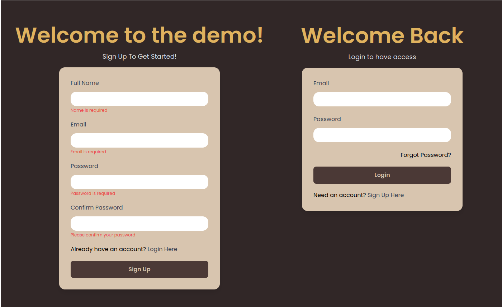

# Custom Sign-in/Sign-up Frontend Web App in Rust and Yew.rs

This repository contains a small custom sign-in/sign-up frontend web application built in Rust. The application allows users to sign in with their existing account or create a new account if they are new to the platform.

# Acknowledgments

This project was created based on a tutorial by [CODEVO](https://github.com/wpcodevo/rust-yew-signup-signin)